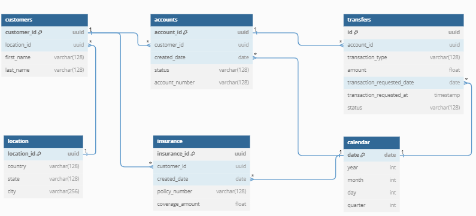

# Data Warehousing Projects

This repository contains SQL scripts and data warehousing projects that demonstrate my expertise in SQL, designing and managing ETL processes, building data models, and writing complex queries for analytical use cases.

### Repository Structure

- `requirements.txt`: Dependencies to recreate the Python environment
- `README.md`: Repository documentation
- `bank-warehouse/` Folder for the Bank Data Warehouse project.

## Project: Bank Data Warehouse

The data for this project was built using synthetic data to mimic real-world banking scenarios, including customer accounts, transactions, insurance policies, and more.

The data warehouse schema is designed to store transactional and customer information, providing a clear structure for analytical queries. Below is an overview of the key tables used in the warehouse:

### Data Warehouse Schema:

  

	
- location: Stores the geographical location details of customers, including country, state, and city.
- customers: Contains customer information such as first name, last name, and the customer's location.
- accounts: Represents customer bank accounts, storing details like account number, creation date, and status.
- transfers: Tracks transactions (deposits, withdrawals) related to accounts, along with the amount and status of each transaction.
- calendar: Provides a date dimension to link transactions and account creation dates for time-based analysis (year, month, quarter).
- insurance: Stores details of insurance policies held by customers, including policy number and coverage amount.

This structure allows for efficient querying of customer data, account transactions, and insurance information, enabling complex reporting and analysis tasks such as customer behavior analysis, transaction trends, and policy coverage reporting.

#### Table of Contents for Bank Data Warehouse

- [Synthetic Data Generation - Python](bank-warehouse/synthetic_data_generation.py)
- [Data Warehouse Schema - DBML](bank-warehouse/bank_diagram.txt)
- [Create Tables - SQL](bank-warehouse/create_tables.sql)
- [Load Data - SQL](bank-warehouse/load_data.sql)
- [Sample Queries - SQL](bank-warehouse/sample_queries.sql)

