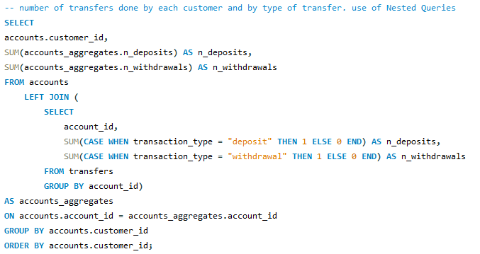
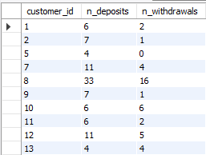
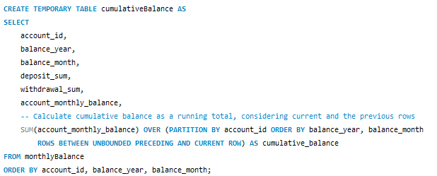
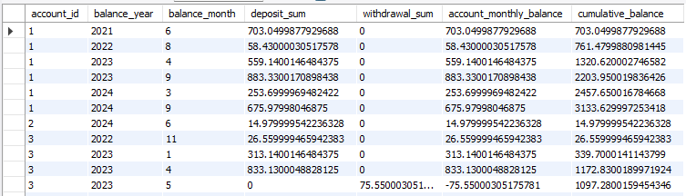
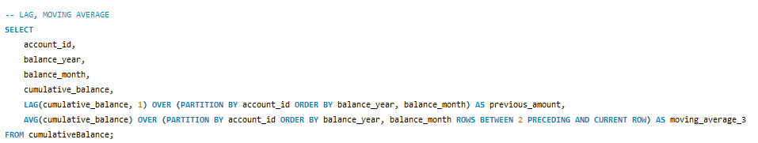
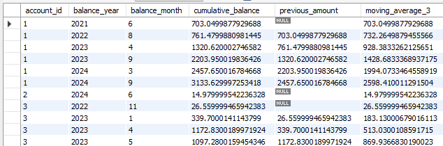

# Data Warehousing Projects

This repository contains SQL scripts and data warehousing projects that demonstrate my expertise in SQL, designing and managing ETL processes, building data models, and writing complex queries for analytical use cases.

### Repository Structure

- `requirements.txt`: Dependencies to recreate the Python environment
- `README.md`: Repository documentation
- `bank-warehouse/` Folder for the Bank Data Warehouse project named NewBank.

## Project NewBank: Bank Data Warehouse

This project simulates real-world banking scenarios using synthetic data, including customer accounts, transactions, and insurance policies. **NewBank** is a hypothetical multinational bank operating in five Latin American countries, offering both banking and insurance services to its customers. The data warehouse schema is designed to efficiently store transactional and customer information, enabling clear and structured queries for analytical use cases.

### Data Warehouse Schema:

  

	
Tables overview:

- `location`: Stores the geographical location details of customers, including country, state, and city.
- `customers`: Contains customer information such as first name, last name, and the customer's location.
- `accounts`: Represents customer bank accounts, storing details like account number, creation date, and status.
- `transfers`: Tracks transactions (deposits, withdrawals) related to accounts, along with the amount and status of each transaction.
- `calendar`: Provides a date dimension to link transactions and account creation dates for time-based analysis (year, month, quarter).
- `insurance`: Stores details of insurance policies held by customers, including policy number and coverage amount.

**Star Schema Design Choice**: The data warehouse follows a star schema design, prioritizing query efficiency and analytical performance over storage efficiency. This design choice was made because the primary goal of this warehouse is to support fast and flexible analytical queries, making it ideal for business intelligence and reporting use cases.

In a star schema, dimension tables like customers, location, and calendar are directly linked to fact tables like accounts, transfers, and insurance. This minimizes the complexity of joins during queries and improves performance, especially for large datasets.

#### Table of Contents for Bank Data Warehouse

- [Synthetic Data Generation - Python](bank-warehouse/synthetic_data_generation.py)
- [Data Warehouse Schema - DBML](bank-warehouse/bank_diagram.txt)
- [Create Tables - SQL](bank-warehouse/create_tables.sql)
- [Load Data - SQL](bank-warehouse/load_data.sql)
- [Sample Queries - SQL](bank-warehouse/sample_queries.sql)

### Examples

In the SQL files you can see the different queries used for exploring the dataset. Here are presented some queries with the results

#### Example 1

  

  

#### Example 2

  

  

#### Example 2

  

  

